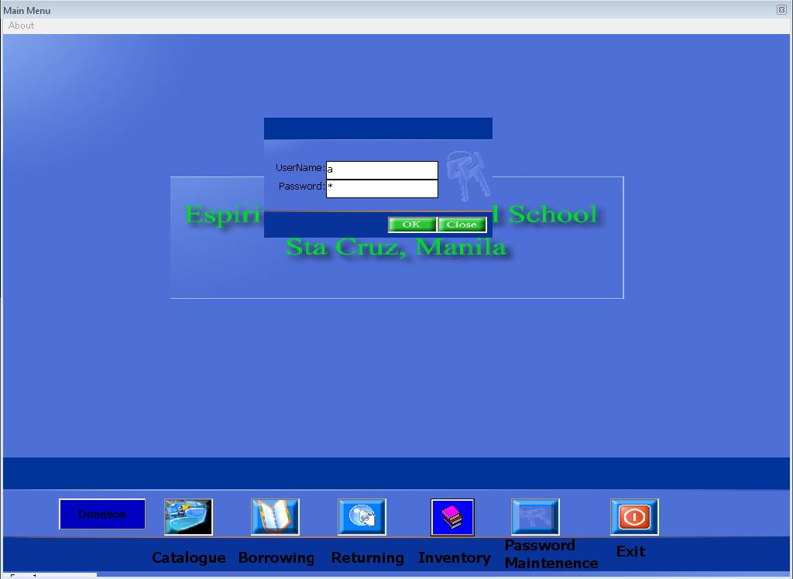



## Simple Library system

### Description

I made this during may SAD subjects in STI.. to all beginners download this and take a look my source code it will help u a lot.. Feel free to use and edit my program.........Credit is enough!! Gudluck!!!
 
### More Info
 

             |
---                |---
**Submitted On**   |2005-02-25 15:15:58
**By**             |[Allan Golondrina](https://github.com/Planet-Source-Code/PSCIndex/blob/master/ByAuthor/allan-golondrina.md)
**Level**          |Advanced
**User Rating**    |5.0 (15 globes from 3 users)
**Compatibility**  |VB 5\.0, VB 6\.0
**Category**       |[Complete Applications](https://github.com/Planet-Source-Code/PSCIndex/blob/master/ByCategory/complete-applications__1-27.md)
**World**          |[Visual Basic](https://github.com/Planet-Source-Code/PSCIndex/blob/master/ByWorld/visual-basic.md)
**Archive File**   |[Simple\_Lib2147933282009\.zip](https://github.com/Planet-Source-Code/allan-golondrina-simple-library-system__1-71915/archive/master.zip)

